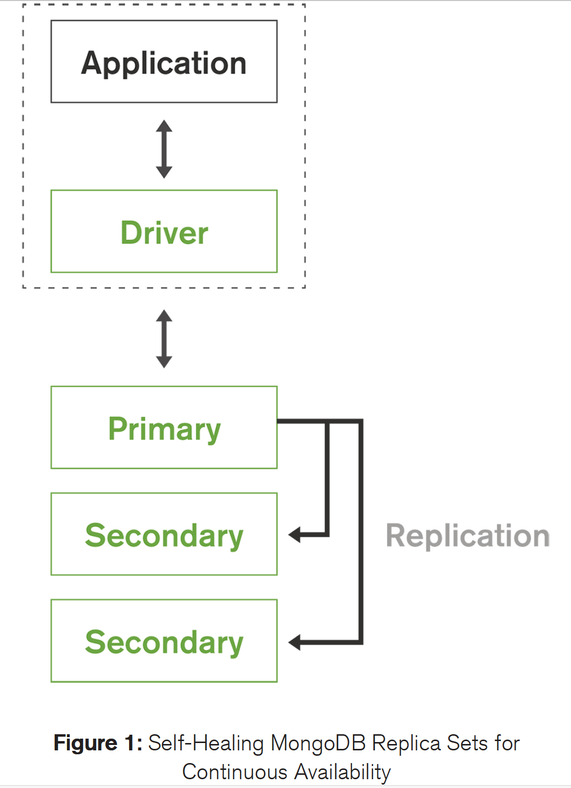

# MongoDB 跨数据中心部署

MongoDB白皮书，2017年11月

参考

https://www.jianshu.com/p/b11e14e68abc

- [MongoDB 跨数据中心部署](#mongodb-跨数据中心部署)
  - [介绍](#介绍)
  - [维护服务的延续性](#维护服务的延续性)
    - [副本集Replica Sets](#副本集replica-sets)
    - [副本集选举](#副本集选举)
  - [扩展MongoDB的持续可用性](#扩展mongodb的持续可用性)
  - [MongoDB数据中心识别](#mongodb数据中心识别)
  - [MongoDB部署模式](#mongodb部署模式)
  - [管理跨数据中心部署方案](#管理跨数据中心部署方案)
  - [MongoDB跨数据中心线上部署](#mongodb跨数据中心线上部署)
  - [结论](#结论)
  - [资源](#资源)
  - [关键词](#关键词)
  - [扩展阅读](#扩展阅读)

## 介绍

关键业务应用必须保证其服务的持续性。随着越来越多的组织需要为全球用户提供线上服务，确保服务在各个分布的地理区域的可用性和可扩展性，在系统设计中变得越来越重要。

将数据库在多个数据中心的区域分布，有三个重要原因：

- **持续可用性：**无论是在自有机房还是公有云上部署数据库，当某个区域发生火灾、洪水或者飓风等灾难导致数据中心停电或断网时，业务方都需要确保服务能够正常使用。Gartner估计宕机造成的业务损失是平均每小时30万美元，如果是面向全球的互联网服务，损失则会更高。
- **用户体验：**不管用户在哪里，用户都需要一致的、低延迟的体验。Amazon有个著名的结论：每增加100ms延迟，导致销售额损失1%。
- **数据合规：**各个国家政府都会控制客户数据存储的地点，数据是不允许被存储在国界之外的。

通过数据中心识别的复制、自动伸缩以及自动化运维，MongoDB可以在全球范围内高效地部署应用，帮助组织用极低的成本、快速开拓市场、达成很高的用户满意度。用户可以自由选择将MongoDB服务部署在自建的数据中心、或者公有云提供商提供的数据中心，又或者直接使用跨区复制的MongDB Atlas云数据库服务。

本白皮书探索了MongoDB数据中心识别的技术基础，展示了多个部署场景，并用线上用户的示例做出总结。

## 维护服务的延续性

在日常运维条件下，MongoDB都能实现系统的性能和功能目标。但是，时而不时总有不可避免的失败或者操作失误导致系统无法正常运行。存储设备、网络链接、电力供应以及其他硬件设备总会出现故障，通过备份可以减少这类风险。类似的，MongoDB数据库支持软件组件以及数据存储等的冗余配置。

### 副本集Replica Sets

MongoDB原生的复制功能维护多个数据副本，叫作**副本集**。用户应该部署副本集来避免数据集宕机。副本集可以自我恢复，因为Failover和恢复全程都是自动的，当发生故障时不需要人为的介入来恢复系统。

通过副本集还可以更灵活地维护系统（例如硬件升级、软件升级），同时保证服务连续性。这是一个非常重要的能力，因为在传统系统中，有三分之一的宕机时间是由这些维护操作导致的。

一个副本集包含多个数据库副本。在任意时间，其中一个是**主要(Primary)节点**，而其他的作为**次要(Secondary)节点**. 如果Primary节点宕机(比如停电、硬件故障、网络分裂(Network Partition))，其中一个Secondary节点会自动被选举为主节点，通常几秒之内客户端链接会自动**故障转移(failover)**到新的Primary节点。在重新选举Primary节点的过程中，其余Secondary节点可以继续提供读服务。为了确保写可用性，在节点失败的事件中，MongoDB Driver会自动重试写操作，由MongoDB服务端保证**Exactly-Once Semantics**, 即保证写操作一定会处理并且只会处理一次。

MongoDB副本集中Secondary节点的个数是可配置的，越多的副本节点可以提供更高的**数据持久性(Data Durability)**以及保护数据避免因为数据库宕机(比如说机器故障(Machine Failure)、机架故障(Rack Failure)、数据中心故障、网络分区)而受损。每个副本集最多可以配置**50个节点**, 能够横跨多个地理站点提供灵活的运维操作和宽广的数据分布。

了解更多副本集的节点可以参考[文档](http://docs.mongodb.org/manual/core/replica-set-members/)。

### 副本集选举

副本集Primary节点失败事件中，选举过程由一系列复杂的算法控制，这些算法基于**Raft一致协议(Raft Consensus Protocol)**的扩展实现。这些算法不仅通过快速故障转移尽可能保证服务可用性，还确保只有最适合的Secondary节点才会参与Primary节点的选举，这减少了没必要的故障转移带来的风险(也就是所谓的False Positive)。在推举一个Secondary节点去参与选举前，选举算法会评估一系列的参数：

- 分析选举标识符、时间戳以及持久化日志来判定当前副本集的节点从主节点同步了最新的改动。
- 和其他大多数副本集节点之间的心跳检测以连接状态
- 用户给当前节点配置的优先级。比如说，管理员可以配置成，只有Primary数据中心故障，部署在Secondary数据中心的节点才能成为候选节点。

一旦选举过程选定了新的primary节点，其他secondary节点会自动从新的primary节点同步数据。当原先的primary节点恢复上线，会检测到当前的状态并立马转换成secondary节点，并同步故障期间发生的所有的写操作。

参考[文档](http://docs.mongodb.org/manual/tutorial/deploy-geographically-distributed-replica-set)了解跨数据中心部署MongoDB副本集的最佳实践和指导。

## 扩展MongoDB的持续可用性

## MongoDB数据中心识别

## MongoDB部署模式

## 管理跨数据中心部署方案

## MongoDB跨数据中心线上部署

## 结论

## 资源

## 关键词

- **Regulatory Compliance：**合规
- **on-premise：** [解释](../../references/private-cloud&on-premise.mdprivate-cloud&on-premise.md)
- **outage：**停电或者网络中断，a period when a power supply or other service is not available or when equipment is closed down 宕机？
- **adverse：**preventing success or development; harmful; unfavorable
- **mitigate：**make less severe, serious, or painful缓和、减轻
- **intervene：**come between so as to prevent or alter a result or course of events，介入，阻挠

- **Hardware Fault：**硬件故障
- **Network Partition：** 网络分裂，网络分裂是将计算机网络划分为相对独立的子网的过程，可以通过设计单独进行优化，也可以由于网络设备出现故障而进行优化。分布式软件必须设计为可以容忍分裂的，也就是说，即使在对网络进行分裂之后，它仍然可以正常工作。
- **Failover：** 故障转移
- **Exactly-Once Semantics：** 精确一次语义
- **Durability：**持久性
- **Data Durability：** The ability to keep the stored data consistent, intact without the influence of bit rot, drive failure, or any form of corruption.
- **bit rot：**位衰减又叫数据衰减，bit指数据位，rot腐烂。由于数据存储设备中非严重故障的累积而导致的计算机数据的逐渐损坏。Bit rot is the slow deterioration in the performance and integrity of data stored on storage media. Also known by the names bit decay, data rot, data decay and silent corruption。
- **Rack Failure：**机架故障，Rack全称为机架式服务器，是用于固定电信柜内的接插板、外壳和设备。
-- **sophisticated：**复杂的

## 扩展阅读

[Raft分布式一致性算法-选举常用](http://oserror.com/distributed/raft-principle-one/)
[False Positive-Bloom Filter](http://oserror.com/backend/bloomfilter/)
